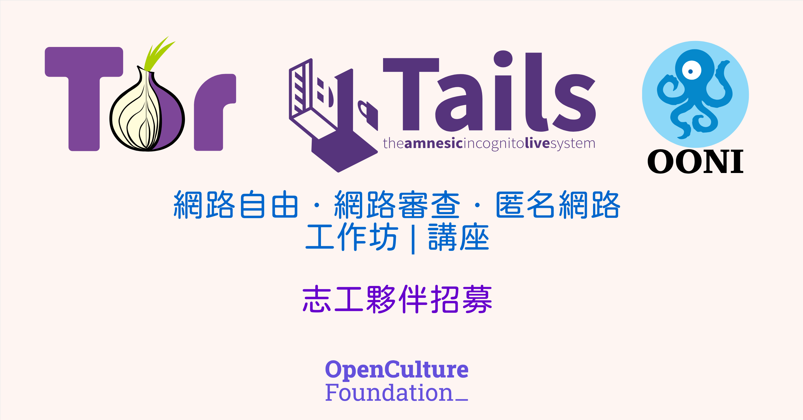

# RightsCon 活動前工作坊

嗨👋各位，預計在 2/23 下午與晚上時段會有一個[工作坊與講座活動](https://ooni-research.ocf.tw/docs/blog/2025/02/rightscon25-tor-tails-ooni/){target="_blank"}需要協助，目前規劃的工作任務如下，如果可以來幫忙的話請告訴我可以的時段與任務。

預計需要 10 位志工夥伴的協助，歡迎一起來參與這活動！

<!-- more -->

## 如何報名

1. 如果您還沒登記意願，請先幫忙[填寫表單](../../apply.md){target="_blank"}。
2. 確認以下時段後，如無法參與全程也沒關係。
3. 直接寄信到[志工信箱](mailto:volunteer@ocf.tw)告知可以參與的時段！:person_bowing:

## 工作任務

-   :hatching_chick:「工作坊」如何使用 Tor 避開審查並匿名瀏覽

    ---

    - **人數：2 位**。
    - 時間：13:30 - 17:30
    - 地點：捷運忠孝新生附近的台北科技大學（第四教學大樓）。
    - 任務：
        - [x] 協助場佈：佈置延長線（會從基金會帶過去）、確認投影與麥克風。
        - [x] 協助報到：協助確定參與者與報到。
    - 需求：
        - [x] 可以簡單英語溝通，部分參與者為海外會眾。
        - [x] 需瞭解活動內容，可以透過[專案介紹](https://ooni-research.ocf.tw/docs/){target="_blank"}瞭解。

-   :hatching_chick:「工作坊」如何使用 OONI 偵測與觀察網路審查狀況

    ---

    - **人數：2 位**。
    - 時間：17:00 - 19:15
    - 地點：捷運忠孝新生附近的台北科技大學（第四教學大樓）。
    - 任務：
        - [x] 場佈：確認投影與麥克風。
        - [x] 報到：協助確定參與者與報到。
        - [x] 場復：回收延長線。
    - 需求：
        - [x] 可以簡單英語溝通，部分參與者為海外會眾。
        - [x] 需瞭解活動內容，可以透過[專案介紹](https://ooni-research.ocf.tw/docs/){target="_blank"}瞭解。

-   :hatching_chick:「講座」Tor 在網路監控的世界中捍衛個人線上隱私權

    ---

    - **人數：6 位**。
    - 時間：18:30 - 21:30
    - 地點：捷運松江南京站及南京復興站附近。
    - 任務：
        - [x] 場佈：確認場地座位是否有到 100 位、確認投影與麥克風。
        - [x] 報到：設立報到台協助確定參與者與報到。
        - [x] 活動開場：協助活動開場與講者簡介。
        - [x] 餐點設置：協助放置餐點放置活動會場後方。
    - 需求：
        - [x] 可以簡單英語溝通，部分參與者為海外會眾。
        - [x] 需瞭解活動內容，可以透過[專案介紹](https://ooni-research.ocf.tw/docs/){target="_blank"}瞭解。

!!! tips ""

    :triangular_flag_on_post: 如果您還沒登記意願，請先幫忙[填寫表單](../../apply.md){target="_blank"}。確認以下時段後，如無法參與全程也沒關係。直接寄信到[志工信箱](mailto:volunteer@ocf.tw)告知可以參與的時段！:person_bowing:
