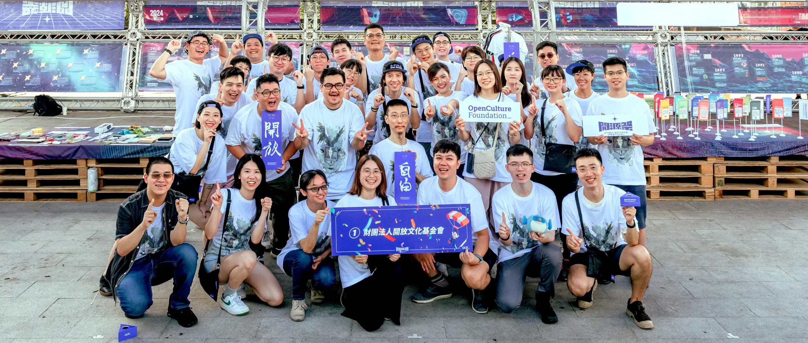

# :raised_hands: 歡迎加入 OCF 志工團隊

<figure markdown="span">
    
    <caption>圖片來源：[淬戀影像工作室攝影](https://quenchwedding.com/){target="_blank"} CC BY 4.0</caption>
</figure>

在 2024 我們舉辦了「[:fire: 開源祭 - 10 週年特別活動](https://10years.ocf.tw/){target="_blank"}」，由於活動規模不同以往，需要許多夥伴來協助我們場佈與活動安排！開源祭活動後，決定好好規劃「OCF 志工團隊」的建立，希望能讓「參與」更加開放！

如果您在未來的一年剛好可以挪出一些時間來參與我們，不論是活動舉辦、到處擺攤推廣開源精神、或是開放科技專案的推動，都歡迎透過以下連結提出申請、登錄！

[:material-account-plus: 志工申請與登錄](./apply.md){ .md-button }
